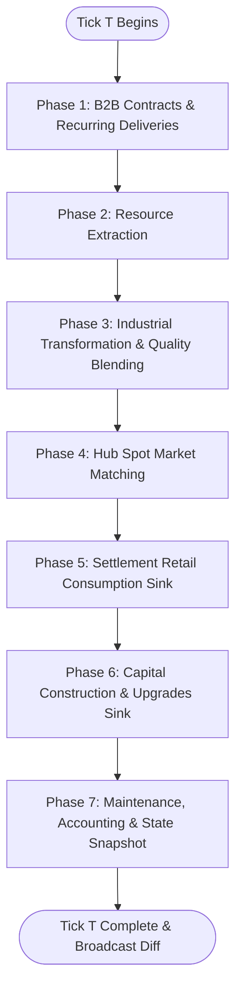

# Simulation Tick Loop

The economic simulation engine advances in discrete, atomic temporal units called **Ticks** (or steps). The simulation does not run on continuous real-time delta time; instead, every economic action, transformation, market match, and delivery is batched and evaluated deterministically within an atomic tick.

For global timing constants and pacing options, see [[configuration-and-parameters]].

---

## 1. Tick Overview & Invariants

Each simulation tick is identified by a monotonically increasing 64-bit integer $T \in \mathbb{N}$ ($T = 1, 2, 3, \dots$).

$$\text{WorldTime}(T) = T_0 + T \times \Delta t_{\text{tick}}$$

Where:
- $T_0$: Unix timestamp of simulation epoch.
- $\Delta t_{\text{tick}}$: Configured duration of each step in seconds (e.g., $60\text{s}$ for 1-minute ticks, or $3600\text{s}$ for 1-hour persistent ticks).

### Core Engine Invariants:
1. **Determinism**: Given the world state $S_T$ and the set of player actions committed before the tick cut-off $A_T$, the transition function produces an identical state $S_{T+1} = f(S_T, A_T)$.
2. **Phase Atomicity**: Phases execute strictly in order. State modifications from Phase $N$ are visible to Phase $N+1$, but actions within the same phase are resolved without intra-phase race conditions.
3. **Double-Entry Balance Preservation**: Every transfer of goods or currency preserves systemic balance: $\Delta \text{Stock}_{\text{seller}} = -\Delta \text{Stock}_{\text{buyer}}$ and $\Delta \text{Cash}_{\text{buyer}} = -(\Delta \text{Cash}_{\text{seller}} + \text{Fees})$.

---

## 2. The 7-Phase Tick Execution Cycle

---

### Phase 1: B2B Contracts & Recurring Deliveries
- **Objective**: Execute automated inter-facility supply agreements negotiated between companies.
- **Mechanism**:
  1. The engine queries all active [[b2b-contracts]].
  2. For each contract, it verifies that the supplier facility has sufficient inventory meeting the minimum quality threshold $Q \ge Q_{\text{min}}$.
  3. Goods are transferred instantly from seller inventory to buyer inventory.
  4. The distance freight fee is computed via [[delivery-and-freight]] and deducted from the buyer.
  5. The agreed purchase price $(P \times \text{Quantity})$ is transferred from buyer to seller.
- **Failures**: If inventory or funds are insufficient, a contract breach flag is recorded for that tick.

### Phase 2: Resource Extraction
- **Objective**: Generate primary commodities from nature deposits.
- **Mechanism**:
  1. For each active extraction facility (farms, mines, lumber camps) on a [[resource-extraction|Resource Node]]:
  2. The base yield is scaled by regional resource modifiers, facility level, and technological upgrades:
     $$\text{ExtractedQty} = \text{BaseYield} \times \text{RegionalMultiplier} \times \text{Level} \times (1 + \text{TechBonus})$$
  3. Extracted raw materials are added to the facility's local storage warehouse at the quality determined by installed equipment and tech ($Q_{\text{harvested}} = \min(100, Q_{\text{equipment}} \times (1 + \text{TechBonus}))$).

### Phase 3: Industrial Transformation & Quality Blending
- **Objective**: Convert raw and intermediate items into higher-tier goods.
- **Mechanism**:
  1. For each active transformation facility, evaluate its assigned recipe from [[transformation-chains]].
  2. Check if local input warehouses hold required materials.
  3. Deduct input materials.
  4. Compute output quality using the weighted blending formula in [[quality-system]]:
     $$Q_{\text{out}} = \min\left(100, \left(\sum_{i=1}^n w_i Q_i\right) \times (1 + \text{FacilityTechBonus})\right)$$
  5. Deposit manufactured output into facility storage.

### Phase 4: Hub Spot Market Matching
- **Objective**: Clear spot market buy and sell limit orders placed by players at regional trade hubs.
- **Mechanism**:
  1. For each trade hub in [[starter-province-map]], process the continuous double auction order books defined in [[spot-exchange-orderbooks]].
  2. Orders are matched using **Price-Time Priority**.
  3. Matched trades settle immediately: seller receives cash (minus market transaction fee), buyer receives goods delivered to their designated facility, and transit freight fees are paid via [[delivery-and-freight]].

### Phase 5: Settlement Retail Consumption Sink
- **Objective**: Absorb finished consumer goods into civilian populations, injecting liquidity back into the corporate economy.
- **Mechanism**:
  1. Each settlement calculates civilian demand for food, apparel, and furniture based on population size and wealth index as specified in [[settlement-consumer-demand]].
  2. The municipal purchasing agent evaluates available sell orders at the local trade hub.
  3. Purchases are scored by consumer utility:
     $$U = \frac{Q^{\alpha}}{P^{\beta}}$$
  4. High-utility goods are purchased until the settlement's per-tick consumption budget is exhausted.

### Phase 6: Capital Construction & Upgrades Sink
- **Objective**: Consume structural materials and capital goods to erect new facilities or expand existing installations.
- **Mechanism**:
  1. Active construction projects and facility level upgrades pull required building materials (Tools, Bricks, Planks, Building Kits) from staging storage as defined in [[capital-construction-sink]].
  2. Once all required materials and construction ticks are fulfilled, the new facility or level status activates for the upcoming tick.

### Phase 7: Maintenance, Accounting & State Snapshot
- **Objective**: Settle operating costs, update financial records, persist world state, and notify connected players.
- **Mechanism**:
  1. Deduct facility base operating maintenance costs from company cash reserves.
  2. Calculate company net worth, revenue, and profit/loss statements as detailed in [[company-management]].
  3. Persist the updated state to PostgreSQL and Redis (see [[system-design-overview]]).
  4. Package tick deltas (executed trades, production results, cash changes) and broadcast via WebSocket to connected web clients (see [[api-and-websocket-protocol]]).

---

## 3. Tick Duration & Synchronization

The length of $\Delta t_{\text{tick}}$ is configured in the environment:
- **Fast Testing / Development**: $5\text{s} - 10\text{s}$ per tick.
- **Standard Active Play**: $60\text{s}$ (1 minute) per tick.
- **Long-term Grand Strategy**: $900\text{s}$ (15 minutes) or $3600\text{s}$ (1 hour) per tick.

The server maintains a tick heartbeat timer. If execution of all 7 phases takes $T_{\text{exec}} < \Delta t_{\text{tick}}$, the server sleeps for the remaining time. If $T_{\text{exec}} > \Delta t_{\text{tick}}$, the tick runner logs a performance alert and immediately commences the next tick without skipping phases.

---

## Related Notes
- [[configuration-and-parameters]] - Global engine parameters and formulas.
- [[system-design-overview]] - Software architecture of the tick runner.
- [[spot-exchange-orderbooks]] - Market execution details.
- [[starter-province-map]] - Geography where ticks execute.
