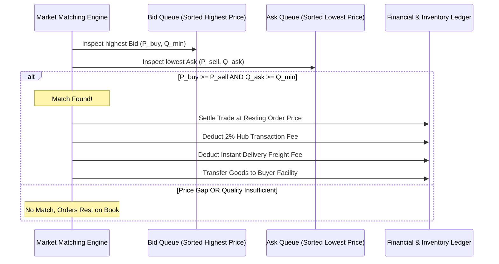

# Spot Exchange Order Books & Hub Trading

Spot exchanges are public trading venues hosted at major settlement trade hubs (such as [[starter-province-map|Port Oakhaven]]). They facilitate open, liquid market price discovery between independent player companies, municipal purchasing agents, and industrial producers during [[simulation-tick-loop|Tick Phase 4]].

For recurring automated supply agreements, see [[b2b-contracts]].
For delivery fees applied upon trade execution, see [[delivery-and-freight]].

---

## 1. Market Architecture: Continuous Double Auction

Each trade hub hosts separate order books for every traded commodity. An order book consists of two prioritized queues:
1. **Bids (Buy Orders)**: Sorted by **Price (Descending)** $\to$ **Placement Time (Ascending)**.
2. **Asks (Sell Orders)**: Sorted by **Price (Ascending)** $\to$ **Placement Time (Ascending)**.

```typescript
export interface MarketOrder {
  id: string;
  marketHubId: string;       // e.g. "node_port_oakhaven"
  companyId: string;
  side: 'BUY' | 'SELL';
  itemType: string;          // e.g. "IRON_INGOT"
  priceLimit: number;        // Max willing to pay (BUY) or Min willing to accept (SELL)
  quantity: number;          // Total units requested
  filledQuantity: number;    // Units matched so far
  qualityRating?: number;    // Exact quality of lot (SELL)
  minQualityRating?: number; // Minimum acceptable quality threshold (BUY)
  sourceFacilityId?: string; // Where goods are stored (SELL)
  destFacilityId?: string;   // Where goods should be delivered (BUY)
  createdAtTick: number;
  expiresAtTick: number;
}
```

---

## 2. Order Matching Algorithm

During [[simulation-tick-loop|Tick Phase 4]], the matching engine clears crossing orders:



### Execution Price Rules:
- When an incoming order matches against a resting limit order already on the book, the trade executes at the **Resting Order's Price**.
- If two orders were entered simultaneously during tick turn collection, the clearing price is the arithmetic **midpoint**:
  $$P_{\text{clearing}} = \frac{P_{\text{buy}} + P_{\text{sell}}}{2}$$

### Settlement Deductions:
1. **Gross Value**: $\text{Gross} = \text{MatchedQty} \times P_{\text{clearing}}$.
2. **Exchange Fee**: The municipal hub collects a transaction fee ($2.0\%$ by default, see [[configuration-and-parameters]]):
   $$\text{HubFee} = \text{Gross} \times 0.02$$
   The seller receives: $\text{Gross} - \text{HubFee}$.
3. **Freight Fee**: Calculated via [[delivery-and-freight]] based on shortest-path distance between seller facility and buyer facility:
   $$\text{Freight} = \text{MatchedQty} \times W(\text{Item}) \times D[\text{SellerLoc}, \text{BuyerLoc}] \times R_{\text{freight}}$$
   Deducted directly from the buyer's balance.

---

## 3. Order Placement & Capital Escrow

To eliminate counterparty default risk:
- **Sell Orders**: The specified quantity of items is immediately locked in the seller facility's warehouse, preventing the company from processing or transferring them elsewhere.
- **Buy Orders**: Cash capital equal to $(\text{PriceLimit} \times \text{Quantity}) + \text{EstimatedMaxFreight}$ is escrowed from the buyer's company balance.
- **Cancellations**: Unmatched orders can be cancelled at any time before the tick cut-off, instantly releasing escrowed cash or inventory.

---

## 4. Market Depth & Transparency

Players and algorithmic agents have access to full Level 2 market depth at every regional hub:
- Current spread: $\Delta P = \text{LowestAsk} - \text{HighestBid}$.
- Aggregated volume by price bucket and quality grade.
- Historical volume-weighted average price (VWAP) recorded over the previous 24, 72, and 144 ticks.

---

## Related Notes
- [[b2b-contracts]] - Alternative direct bilateral supply agreements.
- [[delivery-and-freight]] - Freight fee deduction during settlement.
- [[settlement-consumer-demand]] - How town civilian agents buy from hub order books.
- [[simulation-tick-loop]] - Phase 4 execution details.
