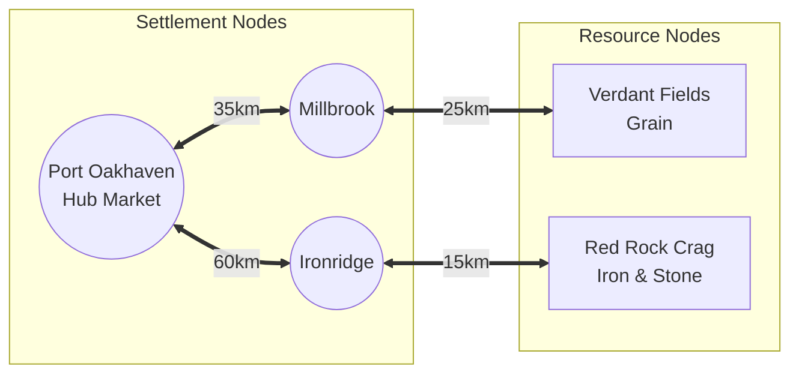
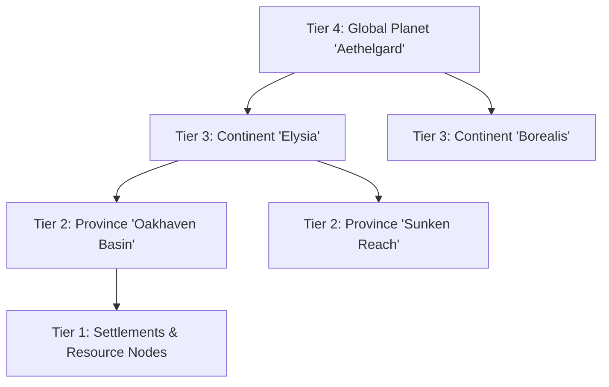

					
# Spatial Graph Model & Planetary Scaling

Space in the economic simulator is modeled as an **undirected, weighted topological graph** $G = (V, E)$ rather than a continuous micro-tile grid. This abstraction allows the simulation to scale effortlessly from a single localized starting region to an entire imaginary planet without incurring prohibitive pathfinding or spatial indexing overheads.

For the initial concrete implementation of this model, see [[starter-province-map]].
For the logistics pricing and freight formulas across this graph, see [[delivery-and-freight]].

---

## 1. Graph Topology: Vertices & Edges

### Vertices ($V$)
Every vertex represents a discrete geographic location where economic activity occurs:
1. **Settlement Nodes ($V_{\text{settlement}}$)**:
   - Contains a civilian population, housing, retail consumption sinks, and public trade hub markets.
   - Example: Towns, cities, provincial capitals, seaports.
   - Reference: [[settlement-consumer-demand]], [[spot-exchange-orderbooks]].
2. **Resource Deposit Nodes ($V_{\text{deposit}}$)**:
   - Natural extraction sites where raw commodities exist in unlimited supply with varying extraction yields.
   - Players claim plots to build extraction facilities (farms, mines, logging camps).
   - Reference: [[resource-extraction]].

### Edges ($E$)
An edge $e = (u, v) \in E$ represents a direct physical transport link between node $u$ and node $v$:
- **Distance ($d_{u,v}$)**: Geometric or traveled distance in kilometers ($\text{km}$), serving directly as the graph edge weight $w(u, v) = d_{u,v}$.

---

## 2. Planetary Scaling Hierarchy

The world expands outward from a local basin to an entire imaginary globe through a 4-tier hierarchy:

1. **Tier 1: Local Nodes**:
   - Extraction plots, factories, local settlement markets.
2. **Tier 2: Provinces**:
   - A cluster of 4-10 nodes connected by dense regional roads.
   - Features 1 primary regional trade hub with a liquid spot exchange order book.
   - The Phase 1 prototype is confined to the [[starter-province-map|Oakhaven Basin]].
3. **Tier 3: Continents**:
   - Multiple provinces linked by inter-provincial rail lines and shipping lanes.
   - Differences in climate, soil fertility, and geological formations produce pronounced regional price spreads.
4. **Tier 4: Planetary Network**:
   - Global trade across oceans and sub-orbital cargo routes.
   - Long-distance trade requires high-value manufactured goods to justify heavy freight costs.

---

## 3. Shortest Path Computation

Since the graph $G$ consists of several dozen to several hundred nodes in early-to-mid phases, the all-pairs shortest paths matrix $D[u, v]$ is pre-computed at server boot using the **Floyd-Warshall** or **Dijkstra** algorithm:

$$D[u, v] = \min_{p \in \mathcal{P}(u, v)} \sum_{e \in p} d(e)$$

The pre-computed distance matrix is stored in Server Memory. Whenever a trade, delivery, or B2B supply contract resolves, distance lookups execute in $O(1)$ time complexity.

---

## Related Notes
- [[starter-province-map]] - The specific starting province layout.
- [[delivery-and-freight]] - Delivery fee equations and examples.
- [[resource-extraction]] - Resource nodes on the spatial graph.
- [[spot-exchange-orderbooks]] - Regional hub exchanges.
