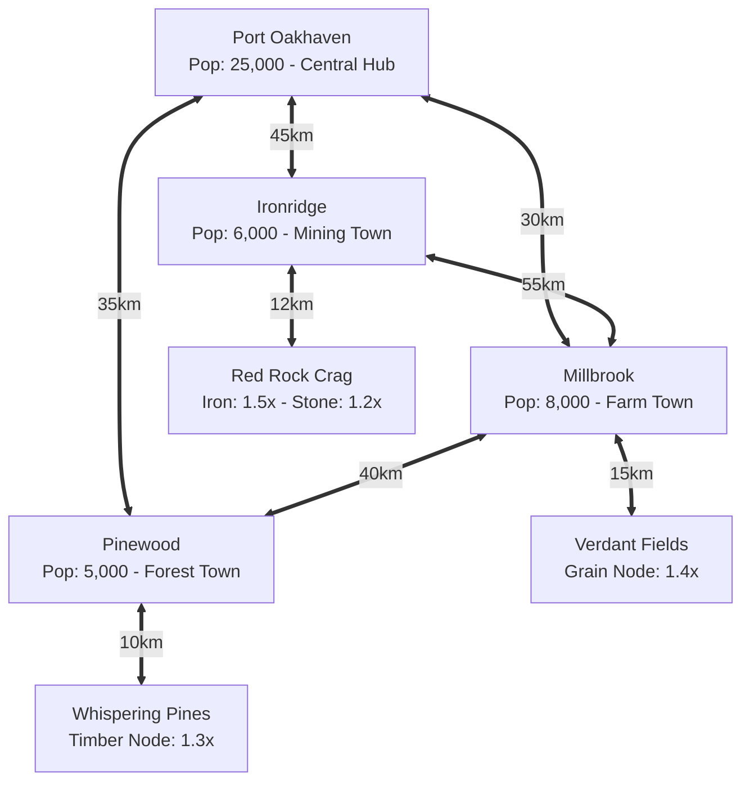

# Starter Province Map: Oakhaven Basin

The **Oakhaven Basin** is the localized starter territory for Phase 1 of the economic simulation. It is designed to be geographically self-sufficient, hosting balanced agricultural, forestry, and mining/metallurgical sectors.

For the mathematical graph foundation, see [[spatial-graph-model]].
For delivery fee calculations across these nodes, see [[delivery-and-freight]].

---

## 1. Map Topology Diagram

---

## 2. Settlement Nodes Directory

| Settlement Node ID | Display Name | Population | Wealth Tier | Specialization | Role |
|---|---|---|---|---|---|
| `node_port_oakhaven` | **Port Oakhaven** | 25,000 | Middle/Upper | Commerce, Shipping, Construction Assembly | Central trade hub host to the primary spot exchange order book; major consumption sink for luxury goods. |
| `node_millbrook` | **Millbrook** | 8,000 | Agrarian | Milling, Food Production, Baking | Agricultural breadbasket; major grain buyer and flour producer. |
| `node_ironridge` | **Ironridge** | 6,000 | Industrial | Smelting, Brick Kilns, Toolsmiths | Heavy industry center nestled at the foot of the mountain range. |
| `node_pinewood` | **Pinewood** | 5,000 | Frontier | Logging, Sawmills, Carpentry | Timber harvesting and woodcrafting center in the boreal forest. |

---

## 3. Natural Resource Nodes Directory

| Resource Node ID | Display Name | Coordinates | Resource Types | Yield Multipliers | Base Deposit Quality |
|---|---|---|---|---|---|
| `node_verdant_fields` | **Verdant Fields** | `(120, 280)` | `GRAIN` | **1.4x** (40% bonus) | $Q = 55$ |
| `node_whispering_pines` | **Whispering Pines** | `(310, 390)` | `TIMBER` | **1.3x** (30% bonus) | $Q = 50$ |
| `node_red_rock_crag` | **Red Rock Crag** | `(420, 110)` | `IRON_ORE`, `STONE` | **1.5x** (Iron), **1.2x** (Stone) | $Q = 60$ (Iron), $Q = 50$ (Stone) |

---

## 4. Distance Matrix & Network Topology

The table below lists all direct edges in the Oakhaven Basin network:

| Origin Node ($u$) | Destination Node ($v$) | Distance ($d$) |
|---|---|---|
| `node_port_oakhaven` | `node_millbrook` | $30\text{ km}$ |
| `node_millbrook` | `node_verdant_fields` | $15\text{ km}$ |
| `node_port_oakhaven` | `node_ironridge` | $45\text{ km}$ |
| `node_ironridge` | `node_red_rock_crag` | $12\text{ km}$ |
| `node_port_oakhaven` | `node_pinewood` | $35\text{ km}$ |
| `node_pinewood` | `node_whispering_pines` | $10\text{ km}$ |
| `node_millbrook` | `node_pinewood` | $40\text{ km}$ |
| `node_ironridge` | `node_millbrook` | $55\text{ km}$ |

### Strategic Geographic Dynamics:
- **Port Oakhaven's Central Hub Role**: As the provincial trade hub, Port Oakhaven connects directly to all three specialized settlements (Millbrook at $30\text{ km}$, Pinewood at $35\text{ km}$, and Ironridge at $45\text{ km}$), enabling efficient distribution across the basin.
- **Local Extraction vs Inter-Settlement Hauls**: Short extraction-to-town routes (e.g. Verdant Fields to Millbrook at $15\text{ km}$, Red Rock Crag to Ironridge at $12\text{ km}$) have minimal delivery overhead, while long peripheral routes between outer settlements (e.g. Ironridge to Millbrook at $55\text{ km}$) incur substantial freight fees, encouraging local processing and trading through the primary exchange.

---

## Related Notes
- [[spatial-graph-model]] - Mathematical formulation of the world graph.
- [[delivery-and-freight]] - Exact shipping fee formulas for these routes.
- [[agriculture-chain]] - Farming in Millbrook & Verdant Fields.
- [[forestry-chain]] - Logging in Pinewood & Whispering Pines.
- [[metallurgy-construction-chain]] - Mining in Ironridge & Red Rock Crag.
