# 🌐 Planetary Economic Simulator — Master Knowledge Vault

Welcome to the central design and architecture repository for the **Multiplayer Step-Ticked Economic Management Simulator**. 

This knowledge base is authored in **Obsidian-flavored Markdown** with bidirectional wikilinks, mathematical modeling formulations, and technical implementation blueprints. It covers both game design mechanics and the software engineering architecture required to run the persistent server engine and interactive web client.

---

## 🗺️ System Architecture & Subsystems Map

```mermaid
graph TD
    MOC((Master MOC<br>docs/index.md)) --> CE[⚙️ Core Engine]
    MOC --> GEO[🌍 Geography & Logistics]
    MOC --> IND[🏭 Industry & Chains]
    MOC --> ECO[📈 Economy & Markets]
    MOC --> PLY[👤 Player Progression]
    MOC --> TECH[💻 Technical Architecture]

    CE --> P1[[simulation-tick-loop]]
    CE --> P2[[configuration-and-parameters]]

    GEO --> G1[[spatial-graph-model]]
    GEO --> G2[[starter-province-map]]
    GEO --> G3[[delivery-and-freight]]

    IND --> I1[[resource-extraction]]
    IND --> I2[[transformation-chains]]
    IND --> I3[[quality-system]]
    IND --> I4[[agriculture-chain]]
    IND --> I5[[forestry-chain]]
    IND --> I6[[metallurgy-construction-chain]]

    ECO --> E1[[spot-exchange-orderbooks]]
    ECO --> E2[[b2b-contracts]]
    ECO --> E3[[settlement-consumer-demand]]
    ECO --> E4[[capital-construction-sink]]

    PLY --> U1[[onboarding-and-licenses]]
    PLY --> U2[[company-management]]

    TECH --> T1[[system-design-overview]]
    TECH --> T2[[data-schemas]]
    TECH --> T3[[api-and-websocket-protocol]]
    TECH --> T4[[ui-design-system]]
```

---

## 📚 Vault Contents by Domain

### 1. ⚙️ Core Engine & Pacing
*Governs the temporal progression, atomic batch execution, and global tuning constants.*
- [[simulation-tick-loop]]: The server-authoritative 7-phase execution cycle running 24/7.
- [[configuration-and-parameters]]: Config schema, tick duration options, freight rates, and market tax constants.

### 2. 🌍 Geography, Spatial Graph & Logistics
*Defines how physical distance, terrain, and transport routes govern trade friction.*
- [[spatial-graph-model]]: The topological node-and-edge graph $G = (V, E)$ scaling from local provinces to the globe.
- [[starter-province-map]]: The concrete **Oakhaven Basin** starter territory (Port Oakhaven, Millbrook, Ironridge, Pinewood).
- [[delivery-and-freight]]: The instantaneous shortest-path distance shipping fee formula and cargo weights.

### 3. 🏭 Industry, Quality & Production Chains
*Raw material extraction, recipe transformations, and quality blending formulas.*
- [[resource-extraction]]: Gathering infinite primary commodities with regional yield modifiers.
- [[transformation-chains]]: Recipe batch throughput, facility level scaling, and input consumption rules.
- [[quality-system]]: The numeric $Q \in [1, 100]$ grading scale, volume-weighted blending math, and tech modifiers.
- **Starter Supply Chains**:
  - [[agriculture-chain]]: Grain $\to$ Flour $\to$ Bread (Civilian Food Demand).
  - [[forestry-chain]]: Timber $\to$ Planks $\to$ Furniture (Civilian Comfort & Construction).
  - [[metallurgy-construction-chain]]: Iron Ore & Stone $\to$ Ingots & Bricks $\to$ Tools & Building Kits (Capital Expansion).

### 4. 📈 Economy, Markets & Consumption Sinks
*Price discovery, automated peer-to-peer pipelines, and macroeconomic circulation.*
- [[spot-exchange-orderbooks]]: Continuous double auctions and limit order matching at regional trade hubs.
- [[b2b-contracts]]: Long-term automated recurring supply agreements executed in Tick Phase 1.
- [[settlement-consumer-demand]]: Civilian retail utility function $U(Q, P) = \frac{Q^{0.6}}{P^{0.9}}$ absorbing finished goods.
- [[capital-construction-sink]]: The heavy industrial sink consuming Building Kits, Tools, and Bricks to build and upgrade facilities.

### 5. 👤 Player Onboarding & Enterprise Management
*The corporate entity, balance sheets, and beginner experience.*
- [[onboarding-and-licenses]]: The Guided Franchise start (Agronomist, Forester, Industrialist) with pre-built facilities and starter capital.
- [[company-management]]: Financial accounting, income statements, net worth formulas, and insolvency rules.

### 6. 💻 Technical Software Architecture
*Full-stack engineering implementation details and wire protocols.*
- [[system-design-overview]]: Fastify + PostgreSQL/Prisma + Redis + React/Vite full-stack system topology.
- [[data-schemas]]: Complete Prisma relational schemas and shared TypeScript domain models.
- [[api-and-websocket-protocol]]: REST API endpoints and real-time WebSocket tick broadcast specifications.
- [[ui-design-system]]: Hard sci-fi industrial telemetry design system, color palette, and typography tokens.

---

## ⚡ Quick Navigation Index

| Subsystem | Primary Document | Core Equation / Rule | Key Dependencies |
|---|---|---|---|
| **Tick Cycle** | [[simulation-tick-loop]] | $S_{T+1} = f(S_T, A_T)$ | [[configuration-and-parameters]] |
| **Delivery Freight** | [[delivery-and-freight]] | $\text{Fee} = N \times W \times D[u, v] \times R_f$ | [[spatial-graph-model]] |
| **Quality Blending** | [[quality-system]] | $Q_{\text{merged}} = \frac{\sum Qty_j \cdot Q_j}{\sum Qty_j}$ | [[transformation-chains]] |
| **Consumer Utility** | [[settlement-consumer-demand]] | $U = \frac{Q^{0.6}}{P^{0.9}}$ | [[spot-exchange-orderbooks]] |
| **Upgrade Sink** | [[capital-construction-sink]] | $\text{Tools} = 2L, \text{Bricks} = 4L, \text{Planks} = 4L$ | [[metallurgy-construction-chain]] |
| **B2B Contracts** | [[b2b-contracts]] | Evaluated prior to spot trading | [[delivery-and-freight]] |
| **Tech Schema** | [[data-schemas]] | Shared TypeScript + Prisma ORM | [[system-design-overview]] |
| **UI Design System** | [[ui-design-system]] | Telemetry tokens & dual-state palette | [[system-design-overview]] |