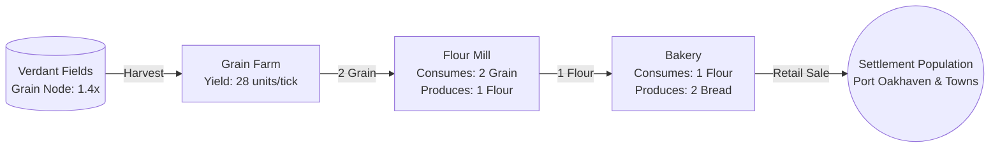

# Agriculture Supply Chain (Food Sector)

The **Agriculture Supply Chain** is the primary survival sector of the economy. It produces basic nutrition (`BREAD`) consumed by settlement populations across [[starter-province-map|Oakhaven Basin]].

For consumer purchase mechanics, see [[settlement-consumer-demand]].
For quality rules and blending, see [[quality-system]].

---

## 1. Supply Chain Architecture

---

## 2. Tier Details & Recipes

### Tier 1: Grain Extraction
- **Facility**: `GRAIN_FARM`
- **Location**: Installed on `node_verdant_fields` or local arable land.
- **Deposit Yield**: Base $20\text{ units/tick} \times 1.4\text{ (Verdant Fields)} = \mathbf{28\text{ units of Grain/tick}}$ at Level 1.
- **Unit Cargo Weight**: $25\text{ kg/unit}$ (see [[delivery-and-freight]]).
- **Unit Marginal Cost**: $\approx 0.89\text{ Cr/unit}$ of Grain.

### Tier 2: Flour Milling
- **Facility**: `FLOUR_MILL`
- **Location**: Typically erected in [[starter-province-map|Millbrook]] or [[starter-province-map|Port Oakhaven]].
- **Recipe**:
  - Inputs: $2\times \text{GRAIN}$ ($w_1 = 1.0$)
  - Outputs: $1\times \text{FLOUR}$
  - Batch Capacity: $1\text{ batch/tick}$ per facility level ($2\text{ Grain} \to 1\text{ Flour}$).
- **Unit Cargo Weight**: $25\text{ kg/unit}$.

### Tier 3: Baking (Finished Consumer Good)
- **Facility**: `BAKERY`
- **Location**: Settlements with large consumer markets (Port Oakhaven, Millbrook).
- **Recipe**:
  - Inputs: $1\times \text{FLOUR}$ ($w_1 = 1.0$)
  - Outputs: $2\times \text{BREAD}$
  - Batch Capacity: $1\text{ batch/tick}$ per level ($1\text{ Flour} \to 2\text{ Bread}$).
- **Unit Cargo Weight**: $10\text{ kg/unit}$.

---

## 3. Sector Economics & Profit Margins

Assuming baseline wholesale prices:
- **Grain**: $\approx 2.0\text{ Cr/unit}$
- **Flour**: $\approx 5.5\text{ Cr/unit}$
- **Bread**: $\approx 4.0\text{ Cr/unit}$ ($8.0\text{ Cr}$ revenue per $1\text{ Flour}$ input)

### Value Addition Summary:
1. $2\times \text{Grain}$ ($4.0\text{ Cr}$) $\xrightarrow{\text{Milling}}$ $1\times \text{Flour}$ ($5.5\text{ Cr}$)
2. $1\times \text{Flour}$ ($5.5\text{ Cr}$) $\xrightarrow{\text{Baking}}$ $2\times \text{Bread}$ ($8.0\text{ Cr}$)

The final product (`BREAD`) is purchased every tick by town populations as specified in [[settlement-consumer-demand]], creating a guaranteed, recession-proof revenue stream for agricultural entrepreneurs.

---

## Related Notes
- [[resource-extraction]] - Natural deposit harvesting mechanics.
- [[transformation-chains]] - Industrial batch processing rules.
- [[settlement-consumer-demand]] - Town civilian food consumption.
- [[starter-province-map]] - Millbrook and Verdant Fields nodes.
