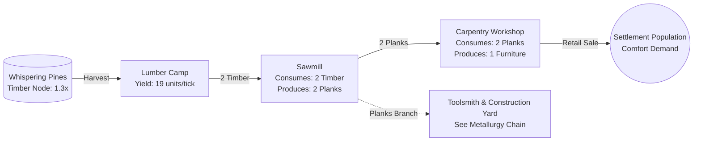

# Forestry Supply Chain (Timber & Woodcraft Sector)

The **Forestry Supply Chain** serves a dual economic purpose in [[starter-province-map|Oakhaven Basin]]. It supplies intermediate structural components (`PLANKS`) to heavy construction, while manufacturing consumer comfort goods (`FURNITURE`) for settlement retail markets.

For construction usage of planks, see [[metallurgy-construction-chain]] and [[capital-construction-sink]].
For furniture consumer demand, see [[settlement-consumer-demand]].

---

## 1. Supply Chain Architecture

---

## 2. Tier Details & Recipes

### Tier 1: Timber Harvesting
- **Facility**: `LUMBER_CAMP`
- **Location**: Installed on `node_whispering_pines` in the Pinewood district.
- **Deposit Yield**: Base $15\text{ units/tick} \times 1.3\text{ (Whispering Pines)} = \mathbf{19\text{ units of Timber/tick}}$ at Level 1.
- **Natural Quality**: $Q = 50.0$.
- **Unit Cargo Weight**: $50\text{ kg/unit}$ (see [[delivery-and-freight]]).
- **Operating Cost**: $20\text{ Cr/tick}$.
- **Unit Marginal Cost**: $\approx 1.05\text{ Cr/unit}$ of Timber.

### Tier 2: Sawmilling
- **Facility**: `SAWMILL`
- **Location**: Erected in [[starter-province-map|Pinewood]] or [[starter-province-map|Port Oakhaven]].
- **Recipe**:
  - Inputs: $2\times \text{TIMBER}$ ($w_1 = 1.0$)
  - Outputs: $2\times \text{PLANKS}$
  - Batch Capacity: $1\text{ batch/tick}$ per facility level ($2\text{ Timber} \to 2\text{ Planks}$).
- **Output Quality**: $Q_{\text{planks}} = Q_{\text{timber}} \times (1 + \text{TechBonus})$.
- **Unit Cargo Weight**: $50\text{ kg/unit}$.
- **Operating Cost**: $25\text{ Cr/tick}$.

### Tier 3: Carpentry (Finished Consumer Good)
- **Facility**: `CARPENTRY_WORKSHOP`
- **Location**: Urban settlements (Port Oakhaven, Pinewood).
- **Recipe**:
  - Inputs: $2\times \text{PLANKS}$ ($w_1 = 1.0$)
  - Outputs: $1\times \text{FURNITURE}$
  - Batch Capacity: $1\text{ batch/tick}$ per facility level.
- **Output Quality**: $Q_{\text{furniture}} = Q_{\text{planks}} \times (1 + \text{TechBonus})$.
- **Unit Cargo Weight**: $10\text{ kg/unit}$.
- **Operating Cost**: $35\text{ Cr/tick}$.

---

## 3. Dual-Market Flexibility

The forestry sector enjoys high price elasticity because planks can be routed in two distinct directions:
1. **Civilian Consumer Channel**: Processing planks into `FURNITURE` to capture recurring retail spending from prosperous urban households in [[starter-province-map|Port Oakhaven]].
2. **Industrial Capital Channel**: Selling planks directly to heavy industry players in [[starter-province-map|Ironridge]] who require planks to produce `TOOLS` and `BUILDING_KITS` for facility construction.

---

## Related Notes
- [[resource-extraction]] - Natural deposit harvesting mechanics.
- [[transformation-chains]] - Industrial batch processing rules.
- [[settlement-consumer-demand]] - Town consumer furniture consumption.
- [[metallurgy-construction-chain]] - Industrial consumption of planks.
