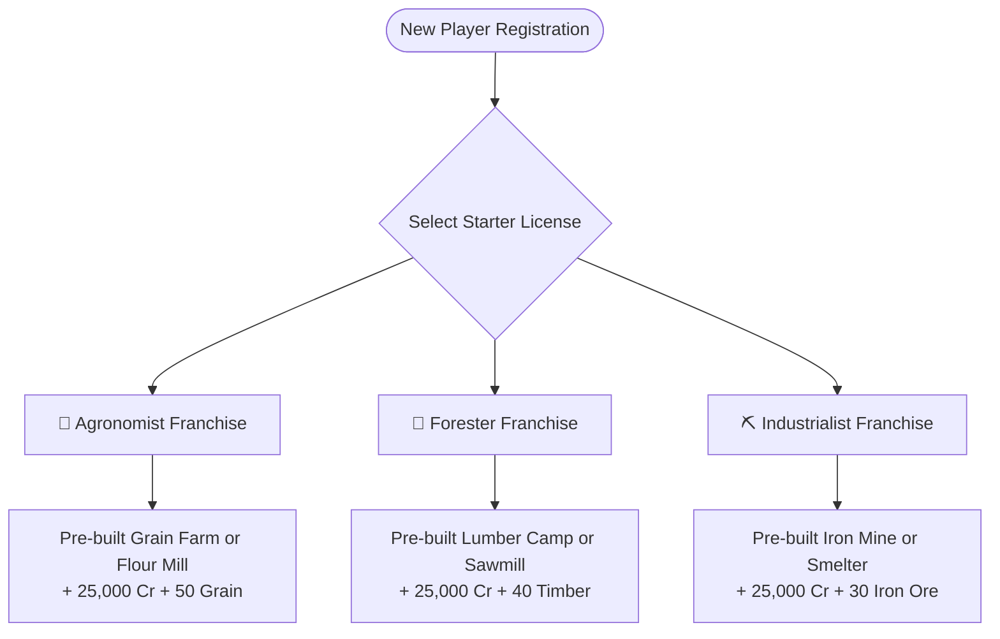

# Player Onboarding & Starter Franchise Licenses

When a new player registers an enterprise in the multiplayer economic simulation, they begin via the **Guided Franchise Starter System**. Rather than facing a blank map with intimidating empty-state decisions, each player selects one of three foundational corporate licenses.

Each starter license grants a pre-constructed Level 1 installation, initial inventory, and operating capital ($25,000\text{ Credits}$, configured in [[configuration-and-parameters]]) to jumpstart immediate gameplay in [[starter-province-map|Oakhaven Basin]].

For managing the newly created corporate entity, see [[company-management]].

---

## 1. The 3 Starter Franchise Packages

---

### Option 1: The Agronomist Franchise (Food & Consumer Focus)
- **Thematic Focus**: Agricultural harvesting, milling, and food distribution.
- **Granted Assets**:
  - **Option A (Extractor)**: Level 1 `GRAIN_FARM` on a dedicated plot at [[starter-province-map|Verdant Fields]].
  - **Option B (Processor)**: Level 1 `FLOUR_MILL` established in [[starter-province-map|Millbrook]].
  - **Initial Liquid Capital**: $25,000\text{ Credits}$.
  - **Seed Stock**: $50\text{ units of Grain}$ ($Q = 55.0$) stored in warehouse.
- **Target Playstyle**: Steady, recession-proof cash flow selling food directly to civilian retail sinks in [[starter-province-map|Port Oakhaven]].

### Option 2: The Forester Franchise (Woodcraft & Construction Support)
- **Thematic Focus**: Timber extraction, lumber production, and furniture crafting.
- **Granted Assets**:
  - **Option A (Extractor)**: Level 1 `LUMBER_CAMP` located at [[starter-province-map|Whispering Pines]].
  - **Option B (Processor)**: Level 1 `SAWMILL` established in [[starter-province-map|Pinewood]].
  - **Initial Liquid Capital**: $25,000\text{ Credits}$.
  - **Seed Stock**: $40\text{ units of Timber}$ ($Q = 50.0$).
- **Target Playstyle**: Flexible producer supplying structural planks to heavy industry while selling furniture to urban consumers.

### Option 3: The Industrialist Franchise (Mining, Metallurgy & Capital Goods)
- **Thematic Focus**: Ore extraction, metal smelting, and tool production.
- **Granted Assets**:
  - **Option A (Extractor)**: Level 1 `IRON_MINE` at [[starter-province-map|Red Rock Crag]].
  - **Option B (Processor)**: Level 1 `SMELTER` established in [[starter-province-map|Ironridge]].
  - **Initial Liquid Capital**: $25,000\text{ Credits}$.
  - **Seed Stock**: $30\text{ units of Iron Ore}$ ($Q = 60.0$).
- **Target Playstyle**: High-margin supplier of metal ingots, tools, and building kits required by all players to construct and upgrade facilities.

---

## 2. Unrestricted Long-Term Diversification

While starter licenses guide the player's initial entry into the economy, **licenses are not rigid player classes**:
- Any company can acquire plots and construct facilities in *any* sector once they earn sufficient capital.
- A player who began with a Grain Farm can reinvest profits to build a Smelter in Ironridge or a Furniture Workshop in Port Oakhaven.
- Companies can verticalize their supply chain (e.g. Grain Farm $\to$ Flour Mill $\to$ Bakery) or specialize horizontally as merchant wholesalers on [[spot-exchange-orderbooks]].

---

## 3. Early Game Milestones & Guidance

The game UI presents new players with actionable corporate milestones:
1. **First Harvest / First Batch**: Configure recipe throughput and run the first simulation tick.
2. **First Market Sale**: List surplus manufactured goods on the [[spot-exchange-orderbooks|Port Oakhaven Spot Exchange]] or fulfill civilian retail demand.
3. **Establishing a Supply Line**: Negotiate a recurring [[b2b-contracts|B2B Contract]] with another player to secure guaranteed input supplies or output sales.
4. **Corporate Expansion**: Accumulate Building Kits and Tools to erect a second facility or upgrade the starter plant to Level 2 (see [[capital-construction-sink]]).

---

## Related Notes
- [[company-management]] - Financial oversight and balance sheet management.
- [[starter-province-map]] - Node locations for starter facilities.
- [[capital-construction-sink]] - Requirements for building subsequent facilities.
- [[spot-exchange-orderbooks]] - Selling starter goods.
