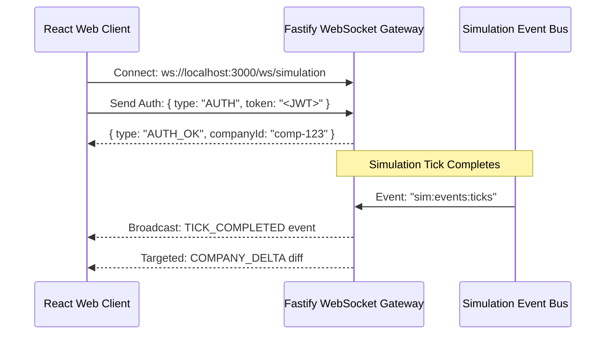

# REST API & Real-Time WebSocket Protocol

This document defines the network communication protocol between the web client and the simulation server. The system uses **Fastify REST endpoints** for command submissions and authenticated queries, paired with a **WebSocket channel** for low-latency tick synchronization and order book updates.

For the system topology, see [[system-design-overview]].
For data types and payloads, see [[data-schemas]].

---

## 1. REST API Specification

All REST requests require the `Authorization: Bearer <JWT_TOKEN>` header unless otherwise marked as public. Responses follow the JSON envelop format `{ success: boolean, data?: any, error?: string }`.

### 1.1 Authentication & Onboarding
- `POST /api/auth/register` (Public)
  - Registers a user account and invokes [[onboarding-and-licenses]] to create a company.
  - Payload: `{ email, password, companyName, ticker, starterLicenseId, startingNodeId }`
- `POST /api/auth/login` (Public)
  - Authenticates user and returns JWT token and company profile.

### 1.2 Spatial World & Map
- `GET /api/map/graph`
  - Returns complete node-and-edge graph for the client map visualizer (see [[spatial-graph-model]] and [[starter-province-map]]).
- `GET /api/map/nodes/:nodeId`
  - Returns detailed node state: settlements, population, available extraction plots, and local facilities.

### 1.3 Facilities & Production
- `GET /api/facilities`
  - Lists all facilities owned by the authenticated company.
- `POST /api/facilities/build`
  - Commits construction of a new installation as defined in [[capital-construction-sink]].
  - Payload: `{ nodeId, facilityType, name }`
- `POST /api/facilities/:id/upgrade`
  - Queues a level upgrade for the facility.
- `PUT /api/facilities/:id/recipe`
  - Selects active manufacturing recipe from [[transformation-chains]].
  - Payload: `{ recipeId }`

### 1.4 Spot Market Trading
- `GET /api/market/:hubId/orderbook?itemType=IRON_INGOT`
  - Returns current Level 2 bids, asks, and recent trades at the specified hub (see [[spot-exchange-orderbooks]]).
- `POST /api/market/orders`
  - Places a new limit buy or sell order into the queue for the upcoming tick.
  - Payload: `{ marketNodeId, side, itemType, priceLimit, quantity, minQuality?, facilityId }`
- `DELETE /api/market/orders/:id`
  - Cancels an active open resting order.

### 1.5 B2B Recurring Contracts
- `GET /api/contracts`
  - Returns active inbound and outbound [[b2b-contracts]].
- `POST /api/contracts/propose`
  - Sends a recurring supply proposal to another company.
  - Payload: `{ recipientCompanyId, sourceFacilityId, destFacilityId, itemType, qtyPerTick, unitPrice, minQuality, durationTicks }`
- `POST /api/contracts/:id/accept`
  - Activates the proposed contract for execution in [[simulation-tick-loop|Tick Phase 1]].

---

## 2. WebSocket Protocol (`/ws/simulation`)

The WebSocket connection delivers real-time notifications to the client as each simulation tick concludes.

### 2.1 Connection Lifecycle


---

### 2.2 Inbound Client Messages

#### Subscribe to Market Depth:
```json
{
  "type": "SUBSCRIBE_ORDERBOOK",
  "payload": {
    "hubId": "node_port_oakhaven",
    "itemType": "FLOUR"
  }
}
```

---

### 2.3 Outbound Server Events

#### Event 1: `TICK_COMPLETED` (Global Broadcast)
Pushed to all active connections immediately following [[simulation-tick-loop|Tick Phase 7]]:
```json
{
  "type": "TICK_COMPLETED",
  "payload": {
    "tickNumber": 1420,
    "worldTime": 1726156800,
    "durationMs": 142,
    "nextTickInSeconds": 60
  }
}
```

#### Event 2: `COMPANY_DELTA` (Private Targeted Message)
Contains all financial and inventory state diffs experienced by the player's enterprise during the tick:
```json
{
  "type": "COMPANY_DELTA",
  "payload": {
    "tickNumber": 1420,
    "cashBalance": 34820.50,
    "cashDelta": 1250.00,
    "netWorth": 128400.00,
    "facilityOutputs": [
      {
        "facilityId": "fac-bakery-01",
        "producedItem": "BREAD",
        "quantity": 4,
        "quality": 58.2
      }
    ],
    "tradesExecuted": [
      {
        "orderId": "ord-8821",
        "itemType": "BREAD",
        "side": "SELL",
        "quantity": 20,
        "unitPrice": 4.20,
        "grossRevenue": 84.00,
        "hubFeeDeducted": 1.68
      }
    ],
    "contractsFulfilled": [
      {
        "contractId": "ct-901",
        "itemType": "FLOUR",
        "quantity": 10,
        "paymentReceived": 55.00
      }
    ]
  }
}
```

---

## Related Notes
- [[system-design-overview]] - Software architecture running these gateways.
- [[data-schemas]] - TypeScript interfaces for payloads.
- [[simulation-tick-loop]] - Event timing in the server cycle.
- [[spot-exchange-orderbooks]] - Order models and double auctions.
