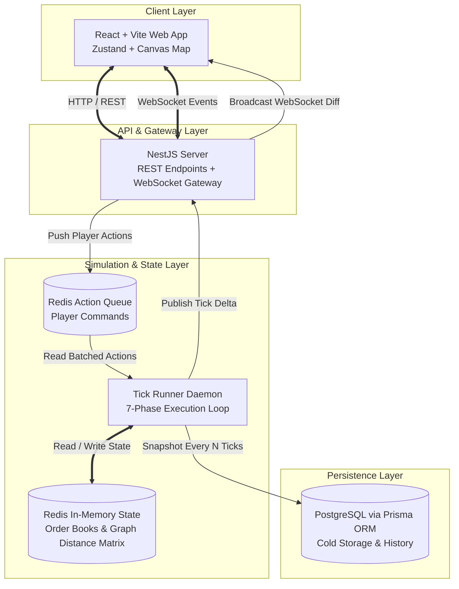

# System Design & Software Architecture

The economic simulation is implemented as a **TypeScript Full-Stack** client-server architecture designed for high I/O throughput, deterministic batch processing, and low-latency real-time synchronization.

For database entity models, see [[data-schemas]].
For network protocols and endpoints, see [[api-and-websocket-protocol]].
For simulation cycle details, see [[simulation-tick-loop]].

---

## 1. High-Level Architecture Topology

---

## 2. Core Subsystems & Responsibilities

### 1. Web Client (Frontend)
- **Framework**: React + with TypeScript, bundled via Vite.
- **State Management**: Zustand for UI state and cached tick snapshots; TanStack Query for asynchronous data fetching.
- **Interactive Map**: SVG/HTML5 Canvas renderer displaying the [[starter-province-map|Oakhaven Basin]] node graph, animated supply lines, and facility icons.
- **Real-Time Client**: Reconnecting WebSocket subscriber listening for `tick_completed` broadcasts.

### 2. Fastify API Gateway (Backend)
- **Runtime**: Node.js (v20+) or Bun.
- **HTTP Routing**: Fastify with JSON Schema validation (`typebox` / `zod`) for lightning-fast request parsing.
- **Authentication**: JWT-based session tokens associating requests with a verified `CompanyId`.
- **Command Ingestion**: Non-blocking endpoint handling. When a player builds a facility or places an order, the command is validated and appended to the **Redis Action Queue** (`sim:actions:pending`) for inclusion in the upcoming tick.

### 3. Tick Runner Daemon (Simulation Engine)
- **Execution Model**: Runs as an isolated worker process or cron scheduler ticking precisely at the configured interval $\Delta t_{\text{tick}}$ (see [[configuration-and-parameters]]).
- **Batch Processing**: At the tick boundary:
  1. Closes the current action queue.
  2. Executes the deterministic 7-phase lifecycle (see [[simulation-tick-loop]]).
  3. Mutates in-memory state in Redis.
  4. Generates a compressed delta diff of all state changes.
  5. Publishes the diff to Redis Pub/Sub (`sim:events:ticks`).

### 4. Persistence & In-Memory Storage
- **Redis (Fast Cache & Message Bus)**:
  - Stores all active order books, shortest-path distance matrices, and active tick counter.
  - Acts as a high-speed message broker between the Tick Runner and multiple Fastify WebSocket gateway instances.
- **PostgreSQL (System of Record)**:
  - Relational persistence managed via **Prisma ORM**.
  - Stores user credentials, company legal records, facility configurations, transaction audit logs, and tick checkpoint snapshots.

---

## 3. Concurrency & Deterministic Isolation

To guarantee that player actions cannot trigger race conditions or mid-tick state corruption:
1. **No Direct Mid-Tick Writes**: API requests **never** directly mutate facility inventories or market order books. All modifications are submitted as signed action messages into the queue.
2. **Atomic Tick Boundaries**: The Tick Runner processes the accumulated actions at the start of Phase 1. Any player action submitted during an active tick is safely held for Tick $T+1$.
3. **Single Authoritative Source**: The server maintains 100% authoritative state. The web client only predicts local UI interactions and reconciles against the broadcasted WebSocket state diff.

---

## 4. Planetary Scaling Architecture

When expanding from the Oakhaven Basin starter province to the entire planet:
- **Spatial Partitioning**: Provinces and continents are partitioned into separate graph clusters.
- **Parallel Phase Execution**: Independent regional trade hubs (Phase 4) and localized extraction (Phase 2) can execute concurrently across worker threads using `WorkerThreads` or `bullmq`, joining before global financial accounting (Phase 7).

---

## Related Notes
- [[data-schemas]] - TypeScript and Prisma relational schema definitions.
- [[api-and-websocket-protocol]] - REST API routes and WebSocket message schemas.
- [[simulation-tick-loop]] - The 7-phase tick lifecycle executed by the runner.
- [[configuration-and-parameters]] - Server configuration options.
